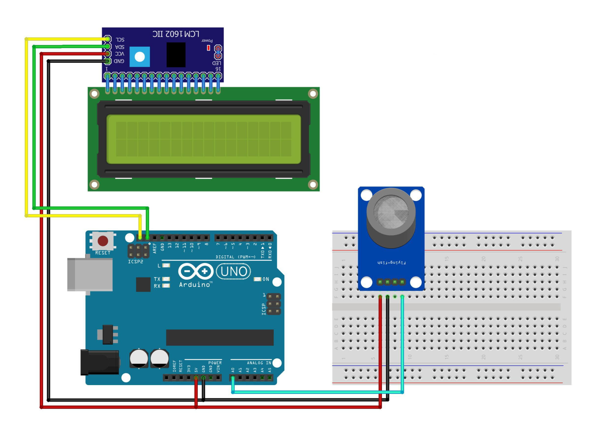

# Indoor Cigarette Smoke Meter (Gas Concentration Monitor with LCD Display)

## Overview

This project monitors gas concentrations using an MQ sensor and displays the results on an I2C LCD. The setup includes calibration of the sensor to ensure accurate readings. The system currently supports detecting smoke concentration.

## Components

- Arduino IDE or Text Editor (e.g., VS Code);
- Library: LiquidCrystal_I2C;
- Arduino board (e.g., Arduino Uno) = 1 unit;
- MQ-2 gas sensor = 1 unit;
- I2C + LCD display = 1 unti set;
- LED (for calibration indication);
- Project Board / BreadBoard = 1 unit;
- Connecting wires.

# Schematic:

- Below you can see a schematic image to facilitate the wiring of cables from the microcontroller to devices, both input and output sensors:



## Circuit Diagram

- Connect the Pin Data MQ-2 sensor to Analog pin A0.
- Connect the I2C LCD to the SDA and SCL pins of the Arduino.
- Connect the LED to digital pin 13.

## Work Steps

**1.** Prepare the tools and materials to be used.
**2.** Carry out the wiring process using Figure schematic of the above circuit.
**3.** Open the Arduino IDE software that has been installed on laptop/computer.
**4.** Download all the libraries above and insert the library by opening the Arduino IDE, selecting Sketch > Include Library -> Add.Zip Library.
**5.** Type the program sketch on the Arduino IDE page.
**6.** Enter the I2C LCD address in the sketch program.
**7.** Carry out the program uploading process.

## Code Explanation

```cpp
#include <LiquidCrystal_I2C.h>      // I2C LCD Library
LiquidCrystal_I2C lcd(0x27, 16, 2); // I2C Address

/************************Hardware Related Macros************************************/
const int calibrationLed = 13;                      // LED pin for calibration indication
const int MQ_PIN = A0;                              // Analog input channel for MQ sensor
int RL_VALUE = 5;                                   // Load resistance in kilo ohms
float RO_CLEAN_AIR_FACTOR = 9.83;                   // Factor for clean air calibration

/***********************Software Related Macros************************************/
int CALIBARAION_SAMPLE_TIMES = 50;                  // Number of samples for calibration
int CALIBRATION_SAMPLE_INTERVAL = 500;              // Time interval between calibration samples (ms)
int READ_SAMPLE_INTERVAL = 50;                      // Time interval between samples during operation (ms)
int READ_SAMPLE_TIMES = 5;                          // Number of samples during operation

/**********************Application Related Macros**********************************/
#define GAS_LPG 0
#define GAS_CO  1
#define GAS_SMOKE 2

/*****************************Globals***********************************************/
float LPGCurve[3]  = {2.3, 0.21, -0.47}; // Curve parameters for LPG
float COCurve[3]  = {2.3, 0.72, -0.34};  // Curve parameters for CO
float SmokeCurve[3] = {2.3, 0.53, -0.44}; // Curve parameters for Smoke
float Ro = 10;                 // Initial value for Ro

void setup() {
  lcd.init();
  lcd.setBacklight(HIGH);

  pinMode(calibrationLed, OUTPUT);
  digitalWrite(calibrationLed, HIGH);
  lcd.print("Calibrating...");                        // Display calibration status

  Ro = MQCalibration(MQ_PIN);                         // Calibrate sensor
  digitalWrite(calibrationLed, LOW);

  lcd.clear();
  lcd.print("done!");                                 // Display calibration result
  lcd.setCursor(0, 1);
  lcd.print("Ro= ");
  lcd.print(Ro);
  lcd.print(" kohm");
  delay(3000);
}

void loop() {
  // Select the gas type by uncommenting the appropriate line
  //long iPPM_LPG = 0;
  //long iPPM_CO = 0;
  long iPPM_Smoke = 0;

  //iPPM_LPG = MQGetGasPercentage(MQRead(MQ_PIN) / Ro, GAS_LPG);
  //iPPM_CO = MQGetGasPercentage(MQRead(MQ_PIN) / Ro, GAS_CO);
  iPPM_Smoke = MQGetGasPercentage(MQRead(MQ_PIN) / Ro, GAS_SMOKE);

  lcd.clear();
  lcd.setCursor(0, 0);
  lcd.print("Smoke Concentration");

  lcd.setCursor(0, 1);
  lcd.print("CO2: ");
  lcd.print(iPPM_Smoke);
  lcd.print(" ppm");

  delay(200);
}

float MQResistanceCalculation(int raw_adc)
{
  return ( ((float)RL_VALUE * (1023 - raw_adc) / raw_adc));
}

float MQCalibration(int mq_pin)
{
  int i;
  float val = 0;

  for (i = 0; i < CALIBARAION_SAMPLE_TIMES; i++) {      // Take multiple samples
    val += MQResistanceCalculation(analogRead(mq_pin));
    delay(CALIBRATION_SAMPLE_INTERVAL);
  }
  val = val / CALIBARAION_SAMPLE_TIMES;                 // Average value
  val = val / RO_CLEAN_AIR_FACTOR;                      // Calculate Ro
  return val;
}

float MQRead(int mq_pin)
{
  int i;
  float rs = 0;

  for (i = 0; i < READ_SAMPLE_TIMES; i++) {
    rs += MQResistanceCalculation(analogRead(mq_pin));
    delay(READ_SAMPLE_INTERVAL);
  }

  rs = rs / READ_SAMPLE_TIMES;

  return rs;
}

long MQGetGasPercentage(float rs_ro_ratio, int gas_id)
{
  if (gas_id == GAS_LPG) {
    return MQGetPercentage(rs_ro_ratio, LPGCurve);
  } else if (gas_id == GAS_CO) {
    return MQGetPercentage(rs_ro_ratio, COCurve);
  } else if (gas_id == GAS_SMOKE) {
    return MQGetPercentage(rs_ro_ratio, SmokeCurve);
  }

  return 0;
}

long MQGetPercentage(float rs_ro_ratio, float *pcurve)
{
  return (pow(10, ( ((log(rs_ro_ratio) - pcurve[1]) / pcurve[2]) + pcurve[0])));
}

```

## Pin Definitions

- CalibrationLed: LED pin for indicating calibration status (13)
- MQ_PIN: Analog input pin for the MQ sensor (A0)

## Functionality

- Initialization:

  - > Initialize the LCD and display a calibration message.
  - > Perform sensor calibration and display the result.

- Main Loop:

  - > Read smoke concentration values.
  - > Display the concentration on the LCD.

- Calibration
  - > Ensure the sensor is in clean air during calibration.
  - > Calibration results are displayed on the LCD.

## Conclusion

- When Sensor Mq-2 starts to activate, the sensor will start detect smoke levels in the room and displays the sensor reading results on the LCD screen.

#### @Copyright 2024 | Indoor-Cigarette-Smoke-Meter
